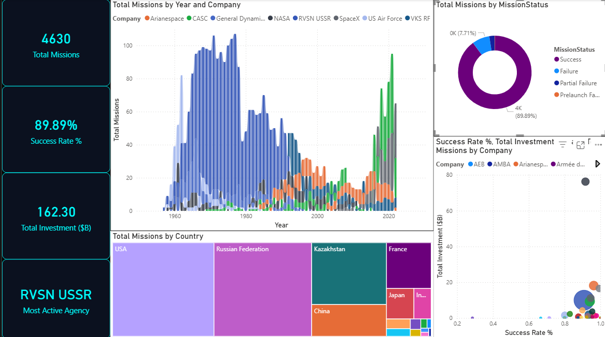

# 🌕 Space Data Analytics (1957-2022)


# 🚀 Global Space Mission Analytics: End-to-End Pipeline

Welcome to the **Space Mission Analytics** repository! 🌌 

This project demonstrates a complete data lifecycle—transitioning from raw data ingestion to executive-level reporting. I analyzed 65 years of space mission data (1957–2022) to uncover the evolution of the global space race.

---

## 🏗️ Project Workflow

The project was executed in four distinct stages to ensure data integrity and deep analytical depth:

### 1. Data Cleaning & Pre-processing (Python) 🐍
Using **Jupyter Notebook**, I performed the initial "heavy lifting." Raw data from Kaggle was often messy or improperly formatted.
- **Extraction:** Parsed the `Location` string to create a dedicated `Country` column.
- **Cleaning:** Handled missing values in the `Price` column and cleaned mission details.
- **Standardization:** Converted date strings into datetime objects for time-series analysis.

### 2. Exploratory Data Analysis (Python) 📊
With clean data, I used **Matplotlib** and **Seaborn** to identify statistical trends and correlations that are difficult to see in raw tables.
- **Efficiency Mapping:** Analyzed the relationship between mission costs and success rates.
- **Launch Distribution:** Visualized how mission frequency changed per decade.


> **🔍 Technical Deep-Dive:**
> **[View the full Python Notebook via nbviewer](https://nbviewer.org/github/vaishnavirj15/Space_mission_analysis/blob/main/space_analysis.ipynb)**

---

### 3. Advanced Analytics & KPI Engineering (SQL) ⚙️
Once the data was structured, I moved it into a **SQL (SQL Server)** environment to perform high-level business logic and aggregations:
- **Success Metrics:** Developed complex CTEs to calculate the `Success Rate %` and `Total Investment` across different eras.
- **Efficiency Logic:** Calculated the `Budget per Success` to compare the ROI of agencies like NASA vs. ISRO.
- **Data Filtering:** Created optimized views to identify the "Top 5" most active agencies, removing noise for the final report.

### 4. "Space HUD" Interactive Dashboard (Power BI) 📈
The final stage was the creation of a futuristic **Heads-Up Display (HUD)** for stakeholders to explore the data interactively.


**Dashboard Features:**
- **The Ribbon Chart:** Highlights the transition from legacy government dominance to the modern private sector era (e.g., the rise of SpaceX).
- **The Scatter Plot:** A visual representation of the "Budget per Success" DAX, identifying which agencies provide the best value.
- **Global Treemap:** Shows the geographic distribution of mission attempts.

---

## 🛠️ Tech Stack
- **Data Wrangling:** Python (Pandas, NumPy)
- **Statistical Visualization:** Python (Matplotlib, Seaborn)
- **Analytical Logic:** SQL (SQL Server)
- **Business Intelligence:** Power BI (DAX, Interactive Design)

---

## 🔑 Key Insights
* **The Efficiency Sweet Spot:** Modern agencies (SpaceX, ISRO) cluster in the high-success/low-to-mid-cost quadrant compared to 20th-century programs.
* **Consistency:** Global mission success rates have stabilized significantly since the early 2000s, maintaining a ~94% average.
* **Leading the Charge:** While the US and Russia lead in historical volume, China and India show the highest growth acceleration in the last decade.

---

## 📂 Repository Structure  

```  

├── /Data                # Datsets 
│   ├── /space_mission
│   ├── /space_mission_cleaned
 

├── /SQL              # SQL scripts for advance analytcis 

├── /Python           #   Jupuyter notebook
├── / Scrrenshot
├── /Space_analysis_dashboard.pbix  #Dashboarad
  

└── README.md                 # Project overview  

```   


---

## 🖥️ Dashboard & Insights

The final stage involved building a futuristic **Heads-Up Display (HUD)** in Power BI to present findings through interactive storytelling.

### **Space Operations Command Center**


### **Executive KPIs**
The dashboard monitors four critical health metrics:
* **Total Missions (4,630):** Cumulative volume of launch attempts since 1957.
* **Success Rate (89.89%):** Primary quality metric for global industry reliability.
* **Total Investment ($162.30B):** Total reported cost normalized to Billions. (Only includes available data, not considering cold war era undisclosed data)
* **Most Active Agency (RVSN USSR):** Historical volume leader based on dataset records.

### **Strategic Insights**
* **The Shift in Dominance:** The **Ribbon Chart** visualizes the transition from the Cold War "Duopoly" (NASA vs. USSR) to a fragmented modern market led by **CASC (China)** and **SpaceX**.
* **Efficiency Leaders:** The **Scatter Plot** reveals that modern commercial players and agencies like **ISRO** are operating in the high-success/low-cost "Efficiency Quadrant."
* **Geographic Expansion:** The **Treemap** shows that while the **USA** and **Russian Federation** hold the largest historical share, global orbital capabilities are diversifying rapidly.

---

## 👩‍💻 About Me  

I’m **Vaishnavi Raj**, a 2025 **B.Tech (Information Technology)** graduate from **Birla Institute of Technology, Mesra**.  

I enjoy working on **Data Analysis and Machine Learning projects** because they allow me to turn **raw data into real insights** that drive decision-making.  
For me, data is more than just numbers — it’s a powerful way to understand patterns, uncover opportunities, and solve **complex, evolving real-world problems**.

This **Space Data analytics** reflects my ability to:  
- Build end-to-end ETL pipelines using Python for data cleaning and SQL for advanced analytical logic.
- Engineer complex KPIs like Success Rate % and Budget per Success to evaluate global agency performance.  
- Perform statistical EDA in Python to uncover deep-seated correlations between mission costs and reliability.
- Design interactive reports in Power BI to deliver high-impact, business-ready insights.  

📫 **Let’s connect:**  
- LinkedIn: [linkedin.com/in/vaishnaviraj721](https://www.linkedin.com/in/vaishnaviraj721/)  
- GitHub: [github.com/vaishnavirj15](https://github.com/vaishnavirj15)  
- Email: rajvaishnavi475@gmail.com  


---
